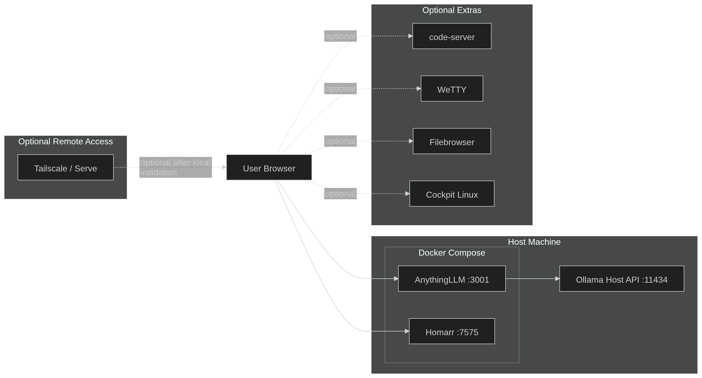

# Local AI

Local-first AI workspace for general users, powered by Ollama, AnythingLLM, Homarr, and optional browser-based tools.

---

## Disclaimer

This project is intended for **local, user-controlled AI workflows**.

It is designed to help you run and manage a personal AI workspace on your own machine with a browser-based interface and optional extras.

By default, this project is meant to be used **locally first**. Optional remote access should only be enabled **after local validation** and should be configured carefully.

---

## Overview

**Local AI** is a beginner-friendly, local-first AI workspace that brings together:

- **Ollama** for local model hosting
- **AnythingLLM** for chat and workspace interaction
- **Homarr** for a clean dashboard and service landing page
- Optional browser tools like:
  - **code-server**
  - **WeTTY**
  - **Filebrowser**
  - **Cockpit**
- Optional **Tailscale / Serve** for remote access after local setup is working

The goal is to give users a simple way to stand up a practical AI environment that feels organized, usable, and expandable without depending entirely on cloud services.

---

## What It Does

Local AI helps you:

- Run AI models locally through **Ollama**
- Access a browser-based AI workspace through **AnythingLLM**
- Use **Homarr** as a central landing page for your services
- Add optional browser-based tools for:
  - code editing
  - terminal access
  - file management
  - system administration
- Keep your workflow local by default
- Optionally enable remote access only after the local setup has been confirmed working

---

## Security Implications

Running AI services locally gives users more control over their workflow, tooling, and data handling than cloud-only setups.

That said, any self-hosted system still requires careful configuration. Browser-based tools, dashboards, APIs, and remote access features should be treated as real services that need responsible setup and review.

This project is designed around a **local-first** approach so users can validate functionality on their own machine before exposing anything beyond it.

---

## Architecture

The diagram below shows the intended flow of the Local AI environment.



### Architecture Summary

- The **User Browser** is the main entry point
- Core services run on the **Host Machine**
- **AnythingLLM** connects to the **Ollama Host API**
- **Homarr** acts as a dashboard for the local workspace
- Optional extras can be exposed in the browser
- **Tailscale / Serve** is optional and should only be enabled after local validation

---

## Requirements

Before installing, make sure you have:

- **Git**
- **Docker**
- **Docker Compose**
- **Ollama**
- A supported operating system:
  - Linux
  - macOS
  - Windows
- Sufficient system resources for local model use
- Internet access for initial dependency and model downloads

More RAM, storage, and CPU/GPU resources will improve the experience when running larger local models.

---

## Installation

### 1) Clone the repository

```bash
git clone https://github.com/RealPhantomLee/Local-AI-Web-Workspace.git
cd Local-AI-Web-Workspace
```

### 2) Copy the environment file

Copy the example environment file before starting the stack. The services will not start correctly without it.

```bash
cp .env.example .env
```

> Open `.env` in any text editor and review the values. The defaults work for a local setup, but you should change any credentials before long-term use.

### 3) Run the installer

The installer checks your prerequisites and starts the stack automatically.

**Linux**
```bash
chmod +x scripts/install/linux.sh
./scripts/install/linux.sh
```

**macOS**
```bash
chmod +x scripts/install/macos.sh
./scripts/install/macos.sh
```

**Windows (PowerShell)**
```powershell
powershell -ExecutionPolicy Bypass -File .\scripts\install\windows.ps1
```

### 4) Verify the stack is running

```bash
docker compose -f compose/docker-compose.yml ps
```

All listed containers should show a status of `Up`. If any show `Exit` or `Restarting`, check the logs:

```bash
docker compose -f compose/docker-compose.yml logs
```

### 5) Pull a model with Ollama

```bash
ollama pull gemma3:latest
```

You can replace that with any model supported by your setup.

---

## Usage

After installation, the main services should be available locally.

### Default local services

| Service | URL |
|---|---|
| AnythingLLM | http://localhost:3001 |
| Homarr | http://localhost:7575 |
| Ollama API | http://localhost:11434 |

### Basic workflow

1. Open Homarr in your browser at http://localhost:7575
2. Open AnythingLLM at http://localhost:3001
3. Connect AnythingLLM to your local Ollama endpoint (see below)
4. Select a locally available model
5. Start using your AI workspace
6. Add optional services if you want more functionality

---

## Example Workflow

1. Install Local AI on a desktop or laptop
2. Start the Docker services
3. Pull a local model through Ollama
4. Open AnythingLLM in the browser
5. Choose the Ollama model
6. Use the workspace for general chat, note-taking, document interaction, and local experimentation
7. Use Homarr as the landing page for the whole stack
8. Add extras like code-server or WeTTY only if needed
9. Enable Tailscale only after everything works locally

---

## Manual Setup

If you prefer to configure the stack manually instead of running the installer, follow these steps.

### 1) Install Ollama

Install Ollama using the official method for your operating system from https://ollama.com.

### 2) Copy the environment file

```bash
cp .env.example .env
```

Edit `.env` and set any credentials or ports you want to change before bringing the stack up.

### 3) Pull a model

```bash
ollama pull gemma3:latest
```

### 4) Start the Docker services

```bash
docker compose -f compose/docker-compose.yml up -d
```

### 5) Verify the containers

```bash
docker compose -f compose/docker-compose.yml ps
```

### 6) Open the local services

- AnythingLLM: http://localhost:3001
- Homarr: http://localhost:7575

### 7) Connect AnythingLLM to Ollama

In AnythingLLM settings, set the LLM provider to **Ollama** and use this endpoint:

```
http://host.docker.internal:11434
```

**Linux users:** if `host.docker.internal` does not resolve, use your host machine's local IP address instead, or add the following to your `compose/docker-compose.yml` under the AnythingLLM service:

```yaml
extra_hosts:
  - "host.docker.internal:host-gateway"
```

### 8) Optional extras

If your Compose file includes optional services, bring them up as needed:

```bash
docker compose -f compose/docker-compose.yml up -d <service-name>
```

Access them through the browser once they show as healthy in `docker compose ps`.

### 9) Optional remote access

Enable Tailscale / Serve only after:

- local setup works
- services are reachable locally
- authentication and access choices are understood

---

## How It Works

Local AI is built around a simple service flow:

- **Ollama** runs local AI models on the host machine
- **AnythingLLM** provides a browser-based interface for interacting with those models
- **Homarr** gives you a clean dashboard to access your tools
- Optional extras expand the workspace with browser-based development, terminal, file, and admin tools
- Optional remote access can be layered on later with Tailscale

### Service Flow

1. The user opens a browser
2. The browser reaches services running locally
3. AnythingLLM sends model requests to Ollama
4. Ollama returns responses from a local model
5. Optional services can be accessed through the same browser-driven workflow

---

## Common Issues

### Ollama is not responding

Check that Ollama is running and see which models are available:

```bash
ollama list
```

If Ollama is not running, start it with:

```bash
ollama serve
```

### Docker containers are not starting

Check container status and inspect logs:

```bash
docker compose -f compose/docker-compose.yml ps -a
docker compose -f compose/docker-compose.yml logs
```

A common cause is a missing `.env` file. Make sure you ran:

```bash
cp .env.example .env
```

### Port conflict

If a service will not start, another application may already be using the port.

Common ports used here:

- 3001 for AnythingLLM
- 7575 for Homarr
- 11434 for Ollama

To use a different port, update the relevant value in your `.env` file and restart the stack:

```bash
docker compose -f compose/docker-compose.yml down
docker compose -f compose/docker-compose.yml up -d
```

### AnythingLLM cannot reach Ollama

Verify Ollama is running:

```bash
ollama list
```

Then confirm the endpoint in AnythingLLM settings is set to:

```
http://host.docker.internal:11434
```

On Linux, if that does not resolve, add `extra_hosts: - "host.docker.internal:host-gateway"` under the AnythingLLM service in `compose/docker-compose.yml`.

### Model is missing

```bash
ollama list
ollama pull gemma3:latest
```

### Tailscale / Serve is not working

Make sure:

- local access works first
- Tailscale is installed and authenticated
- the service you want to expose is already healthy
- your Serve configuration points to the correct local address

---

## Project Structure

```
Local-AI-Web-Workspace/
├── README.md
├── .env.example
├── .gitignore
├── .gitattributes
├── LICENSE
├── compose/
│   └── docker-compose.yml
├── scripts/
│   └── install/
│       ├── linux.sh
│       ├── macos.sh
│       └── windows.ps1
├── docs/
│   └── images/
│       └── local-ai-architecture.png
├── bootstrap/
└── templates/
```

| Path | Purpose |
|---|---|
| `.env.example` | Copy this to `.env` before starting the stack |
| `compose/` | Docker Compose file for the service stack |
| `scripts/install/` | Installer scripts by operating system |
| `docs/images/` | Architecture diagram and README images |
| `bootstrap/` | First-run or initialization helpers |
| `templates/` | Configuration templates for services |

---

## How to Protect Yourself

- Keep the project local-first
- Do not expose services publicly unless you understand the implications
- Change any default credentials before long-term use
- Use strong authentication where supported
- Keep your operating system and containers updated
- Avoid storing secrets directly in tracked files
- Review any remote-access changes before enabling them
- Only enable optional tools you actually plan to use

### Good Practice

- Validate everything locally first
- Enable Tailscale only after the local environment is stable
- Keep access limited to systems you control
- Review logs if something behaves unexpectedly

---

## Ethical & Legal Considerations

This project is intended for use on systems and environments you own, manage, or are explicitly authorized to administer.

Users are responsible for:

- Complying with local laws and regulations
- Respecting software licenses
- Securing exposed services
- Protecting their own data and access credentials

If you choose to enable remote features, do so carefully and with clear authorization boundaries.

---

## Third-Party / Upstream Projects

| Project | License |
|---|---|
| [Ollama](https://github.com/ollama/ollama) | MIT License |
| [AnythingLLM](https://github.com/Mintplex-Labs/anything-llm) | MIT License |
| [Homarr](https://github.com/ajnart/homarr) | Apache License 2.0 |
| [code-server](https://github.com/coder/code-server) | MIT License |
| [WeTTY](https://github.com/butlerx/wetty) | MIT License |
| [Filebrowser](https://github.com/filebrowser/filebrowser) | Apache License 2.0 |
| [Cockpit](https://cockpit-project.org/) | Mixed licensing; see upstream LICENSES/ |
| [Tailscale](https://github.com/tailscale/tailscale) | BSD 3-Clause License |

---

## License

License terms for this repository should be taken from the LICENSE file in this project.
